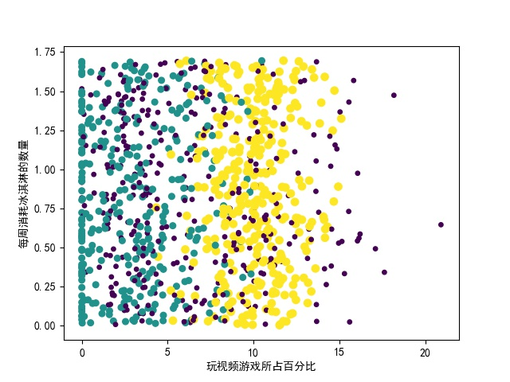
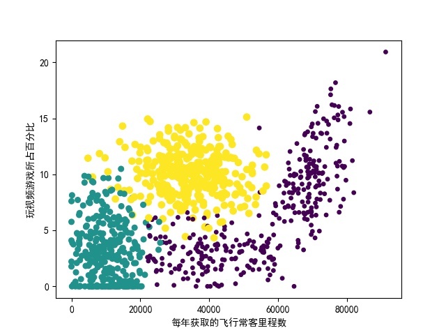

使用K-近邻算法改进约会网站的配对效果
把数据文件读成numpy矩阵，构建散点图
发现使用23列数据构建散点图如下,数据点参杂在一起，无法轻松的分开

使用12列数据构建散点图如下，数据较好的分离开来，我们使用12列数据进行分析。观察发现x轴数据数量级很大，如果计算距离会导致x轴对结果影响过大。因此对数据进行归一化。
使用如下公式进行归一化
newValue=(oldValue-min)/(max-min)。
使用函数autoNorm进行归一化
并使用KNN中的分类器进行分类，计算结果